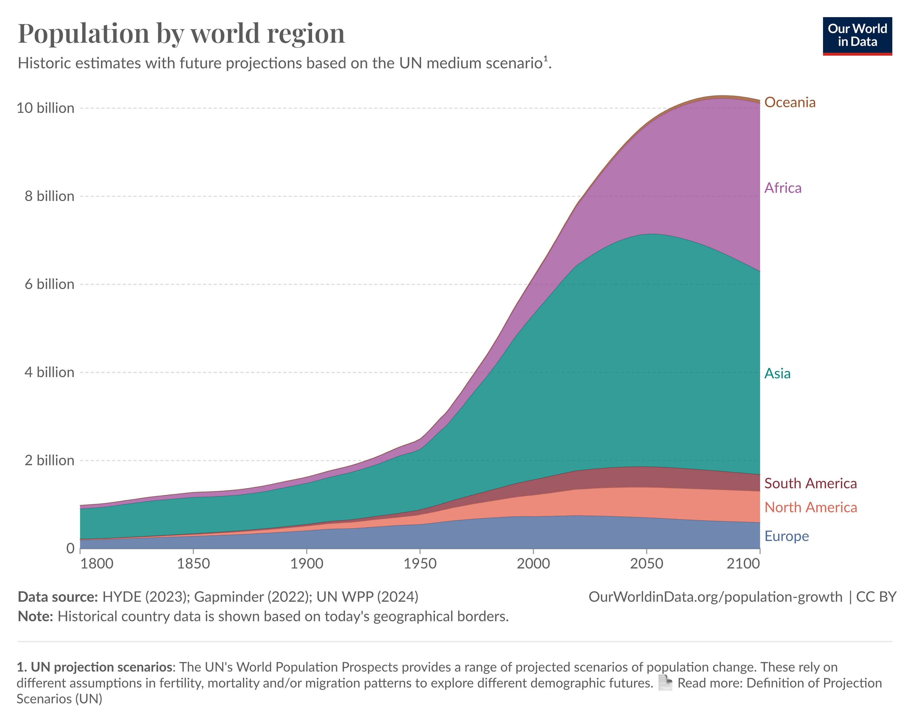
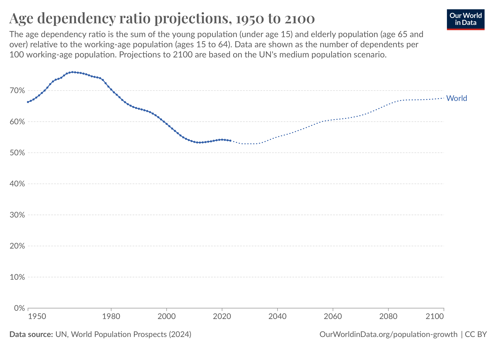
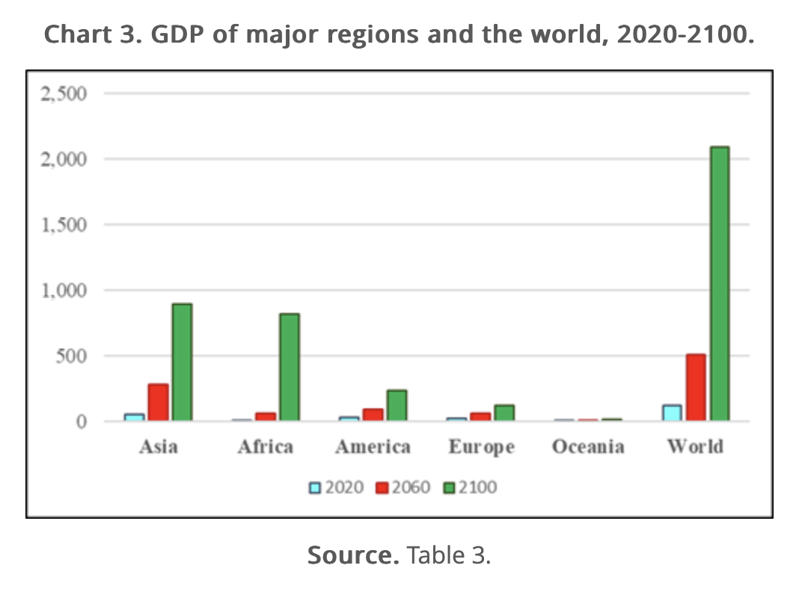
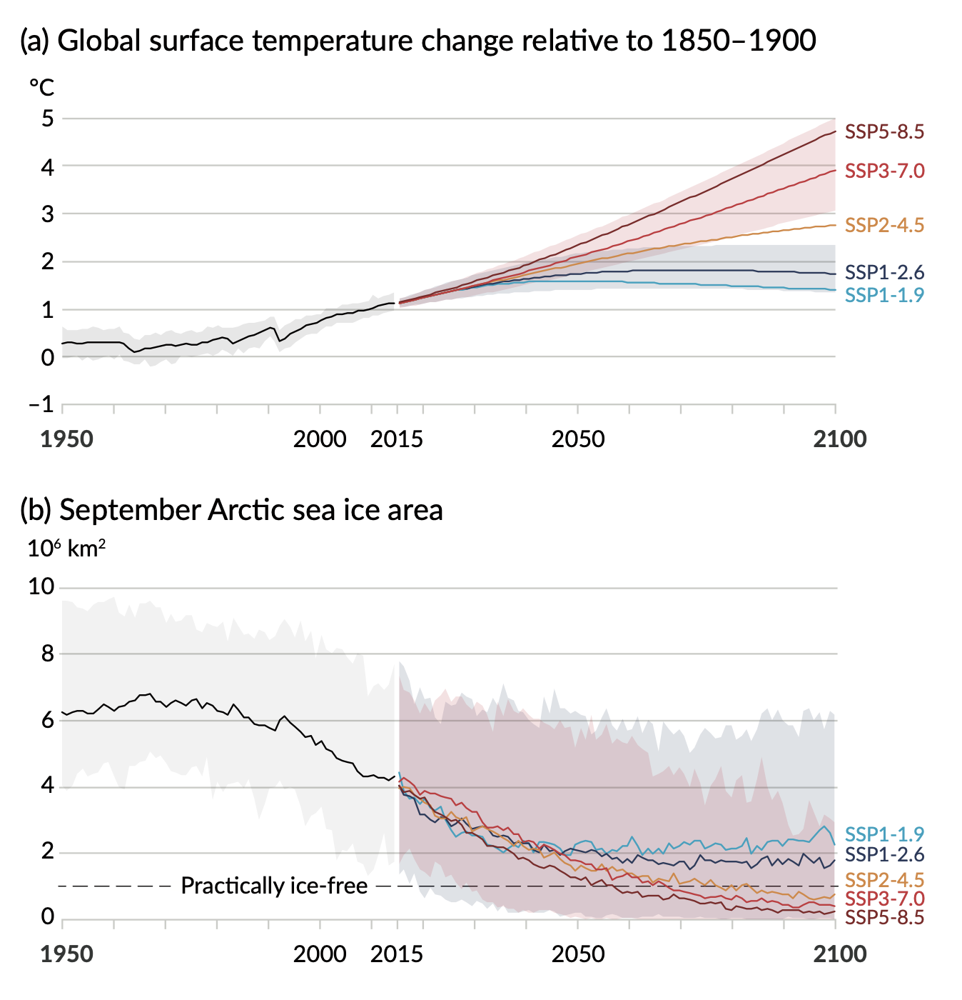

World building is, for me, one of the most enjoyable parts of writing fiction. Creating a world inside my head and exploring it through my characters is a lot of fun!

When a fictional world is set in the near future, I may want it to feel familiar and yet otherworldly. To do this, I begin by thinking about the world as it exists today, and imagining what our future might look like as a springboard into creating a fictional world. But I don't need to rely on my imagination alone. 

There are many forecasts available to learn what the world might be like in the future. If you're looking to bake some plausibility into your world-building (and it's fine if you're not!) then you may find these resources useful.

I've focussed on global-scale data for population, age demographics, economy, and climate change, but many of the linked resources also provide data for regions and countries. In my commentary I've highlighted some interesting points made in these forecasts, but I'd encourage you to explore further to get a sense of what is expected in different parts of world.

## World Population

While the world's population continues to rise, population growth is slowing. The UN forecasts that global population will peak at 10.4 billion in 2086 and begin to fall before the end of the century. This growth will not be evenly distributed, with most population increase expected in Asia and Africa.

By 2100 it is expected that almost all people (85% globally) will live in urban areas.

In West Africa, a region of 9 cities including Abidjan and Lagos, is set to become the most densely populated region on the planet and could be home to 500 million people by 2100. The current largest urban area is the Greater Bay Area in China, home to 70 million people.

This may sound startling, but it could mean that in the future more people enjoy a higher quality of life than today.

> There are many examples — across broad areas of development — that suggest that, on average, living standards are higher in urban populations than in rural ones.

**Resources:**

- [Our World In Data: Population by Region Chart](https://ourworldindata.org/grapher/population-regions-with-projections)
- [Two centuries of rapid global population growth will come to an end](https://ourworldindata.org/world-population-growth-past-future)
- [We are Entering the Era of the Megalopolis, Supercities Connected by Urban Sprawl](https://es.weforum.org/videos/we-are-entering-the-era-of-the-megalopolis-supercities-connected-by-urban-sprawl/)
- [Our World in Data: Urbanisation](https://ourworldindata.org/urbanization)

## Age Demographics

Through the rest of the century life expectancy will continue to rise. Most people can expect to live longer, but this does not mean that the population as a whole will be older. 

Right now there are relatively few people of working age compared to those who are not (the so-called "ageing population" crisis). But due to shifts in the demographic make-up, the working age share of the population is expected to begin rising by 2040, and continue to rise through the end of the century. 

**Resources:**

- [Our World in Data: Age Structure](https://ourworldindata.org/age-structure)

## Global Economy

The growth of population in Asia and Africa will drive economic growth in these regions. By the end of the century, most of the world's economy will be focussed in these areas.

> The big gainer will be Africa, whose share in GWP will rise from 5% in 2020 to 39% in 2100. Within Africa, the growth in the global share will be slowest in Northern and Southern Africa, with their combined regional share falling from 49% in 2020 to 14% in 2100. The fastest growth will be in Eastern Africa, whose regional share will rise from 17% in 2020 to 35% in 2100.

Relatedly, the share of people living in extreme poverty worldwide is expected fall below 2% in 2050, down from 8% in 2023. The World Bank defines extreme poverty as living on less than $2.15 a day.

**Resources:**

- [What will the world economy look like in 2100?](https://www.ubss.edu.au/articles/2022/july/what-will-the-world-economy-look-like-in-2100/)
- [Eradicating extreme poverty by 2050?](https://www.weforum.org/agenda/2023/04/extreme-poverty-eradicated-growth-think-tank/)

## Climate Change

It's not possible to forecast the near-future, without considering the effects of climate change. Forecast scenarios vary, and are heavily dependent on action taken today, but it is clear that the world will be warmer, and sea levels will be higher.

Tools like the [NASA Sea Level Projection Tool](https://sealevel.nasa.gov/ipcc-ar6-sea-level-projection-tool) and [World Flood Map](https://www.floodmap.net) can be used to visualise the effects of climate change on sea levels and coastal communities.

**Resources:**

- [IPCC Summary for Policy Makers](https://www.ipcc.ch/report/ar6/wg1/downloads/report/IPCC_AR6_WGI_SPM.pdf)
- [IPCC CLIMATE CHANGE 2023](https://www.ipcc.ch/report/ar6/syr/)
- [NASA Sea Level Projection Tool](https://sealevel.nasa.gov/ipcc-ar6-sea-level-projection-tool)
- [World Flood Map](https://www.floodmap.net)

## A Bright Future?

The above are just a handful of resources showing what the world might look like in the near-future. While the population will be larger, more people will live longer and experience a higher quality of life than today - especially in Africa.

I hope that you find these resources useful in your world-building, but also I hope that you find them interesting in their own right. It is easy for us to feel despondent about the world, but there are many reasons to feel good about our future. 

If you're interested in this topic, I'd recommend the excellent book [Factfulness by the late Hans Rosling](https://www.gapminder.org/factfulness-book/) which makes a strong case for optimism.

Take care and happy writing!

❤️