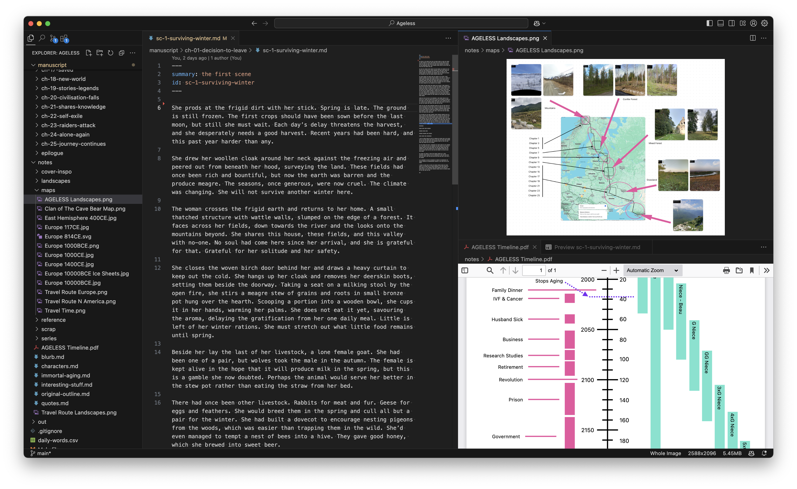
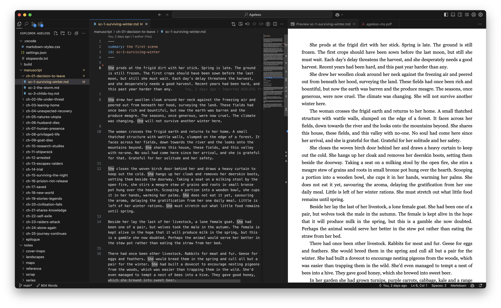
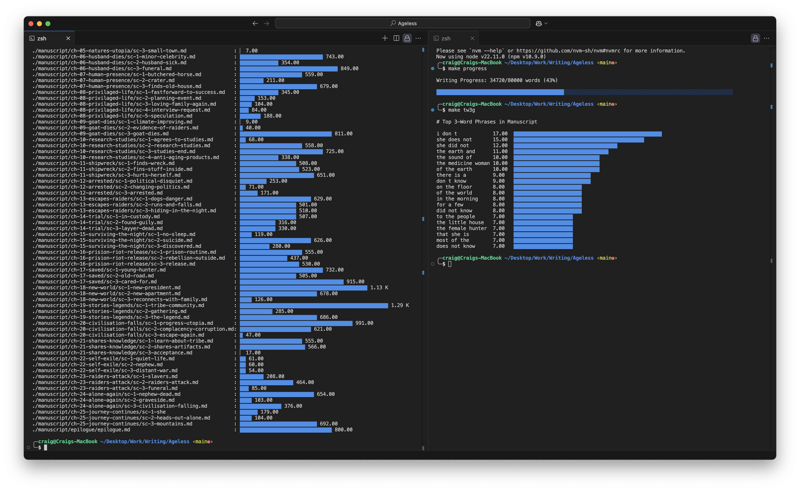

While working on my novel, I've become increasingly frustrated that the tools available for creative writing are not as good as the tools used for writing software.

I've been a software developer for over two decades, I've written a lot of software, using a lot of different tools, and I can tell you that software developers _hate_ crappy tools. The eco-system for software development never stands still, there are always new tools to try, and because we're spoiled for choice, software developers highly value quality tools that make their lives easier.

As a creative writer, I can't say the same. In working on my novel, I've used a range of "specialist" tools, some free, others cost money, and I'm always left wanting. Some give more than others, but eventually I find that there's always something that irritates me enough to take me out of the flow when I'm writing.

Recently I was writing a post for this blog, which I write in VSCode, and I thought "Why don't I use the same for my novel?". So I ported my WIP into VSCode and honestly it's the best thing ever.

## What is Visual Studio Code?

[Visual Studio Code (VSCode)](https://visualstudio.microsoft.com/#vscode-section) is a software editor developed by Microsoft. It's free, and works on Mac, Windows, and Linux. It's lightweight, fast, heavily customisable and has become one of the most popular software development tools in use today.

[The layout](https://code.visualstudio.com/docs/getstarted/userinterface) of VSCode is highly configurable. Multiple editor tabs can be open at once, viewing different files of different types, and arrange these conveniently in panels. This is especially useful when having to refer to notes and reference documents.



[The explorer](https://code.visualstudio.com/docs/getstarted/userinterface#_explorer-view) in VSCode (left-hand side) shows files and folders on your computer, there's no proprietary project format, and no danger of a _corrupted project_ to cry over. All the drag and drop, copy and paste, and file management you're used to works as expected, and you can use any backup solution you want to keep your work safe (iCloud, DropBox etc.)

VSCode has a [huge variety of themes](https://code.visualstudio.com/docs/getstarted/themes) and plugins to configure the editor to your liking. These can be installed from the marketplace, which is available from the plugins tab. There are [several plugins designed for creative writers](https://marketplace.visualstudio.com/items?itemName=danspinola.vscode-for-writers) using VSCode including spell checkers, word count tools, random name generators and more.

VSCode has many other features that are useful for creative writing. There's the [Minimap](https://code.visualstudio.com/docs/getstarted/userinterface#_minimap), which shows a zoomed-out view of documents alongside the scroll bar. [Multiple cursors](https://code.visualstudio.com/docs/editor/codebasics#_multiple-selections-multicursor), which are so useful you'll wonder how you ever lived without them. It has a powerful [find & replace](https://code.visualstudio.com/docs/editor/codebasics#_find-and-replace), [Zen mode](https://code.visualstudio.com/docs/getstarted/userinterface#_zen-mode) for focussed writing, and loads of handy [keyboard shortcuts](https://code.visualstudio.com/docs/getstarted/keybindings) for moving around and editing text. Most of the functionality is configurable so you can really streamline your workflow.

## What is Markdown?

I write in [Markdown](https://www.markdownguide.org/) (one scene per file), which is a super simple way to add formatting to text without getting distracted with styling. Markdown files are plain text, with a few special characters to denote different formatting when the document is compiled. It looks like this:

```
# Chapter 1

This is a paragraph of text, with _italics_ and **bold**.

> This is a quote

"Dialogue goes in quotes", said Sam
```

Personally, I prefer to write in plain text, as I find there are fewer distractions. Also when I'm pasting text from other documents or websites, I don't want to bring in any formatting that I then have to clean up.

However, I do like to visualise how my text might look when compiled, which I find easier for proofreading as I go. Helpfully VSCode has a built-in Markdown previewer, so I can see how my document will look when compiled. Like most things, this is easy to configure, I like mine to look like a printed page.



## How Do I Compile My Manuscript/ePub/PDF?

For compiling my manuscript I've been using [Pandoc](https://pandoc.org/), which is a tool to convert files between different formats. Pandoc takes in all my markdown files and builds them into documents formatted for print or digital distribution.

It's a very well established tool, and I suspect near-universal. I imagine most creative writing software uses Pandoc under-the-hood.

If you're technically minded, it's quite easy to get it set up to export all the file formats you want, styled as you want them to be. I'm still figuring some of this out, but I've got it working well enough for now, allowing me to read my novel on my kindle, which I prefer when reviewing my progress.

## What Else?

Because my manuscript files are all plain text, it's really easy to perform analysis of my writing. I've written a few scripts for myself to track my writing progress, show word count and common phrases. As I need more, I can create these for myself, without being limited by the software I'm using.



## Sounds great, how do I get started?

If you have some experience with software development tools, you'll have no trouble getting VSCode setup for creative writing. If not, it may take a little effort to learn a few new things along the way.

But if you value a powerful tool that can be configured to support your way of working, then I think it's worth the effort.

Download [Visual Studio Code](https://visualstudio.microsoft.com/#vscode-section), and give it a try!

Let me know how you get on!

❤️
