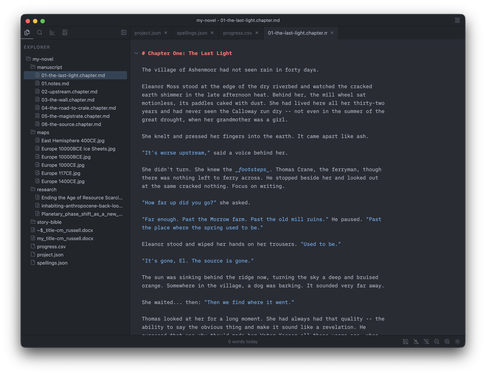
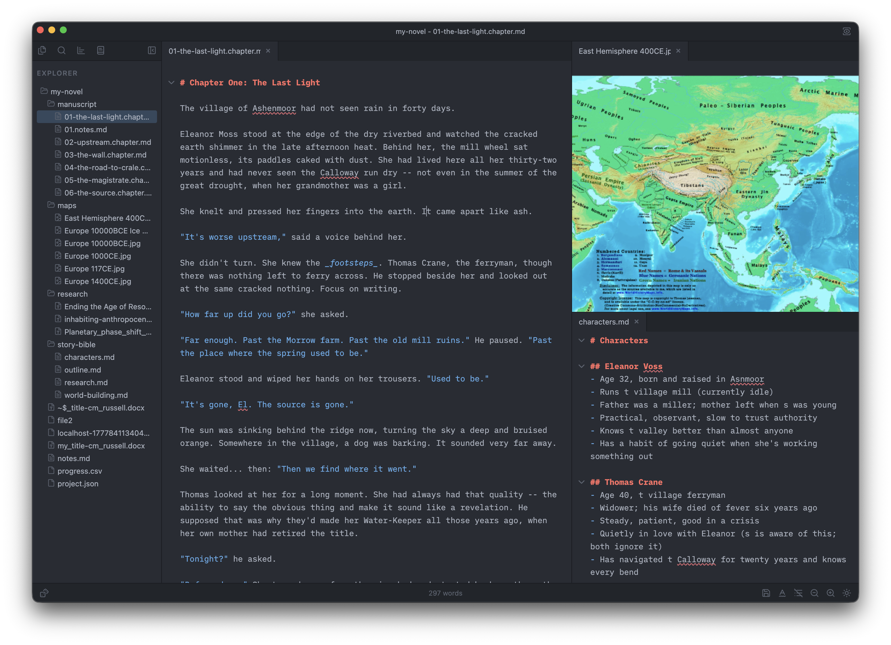
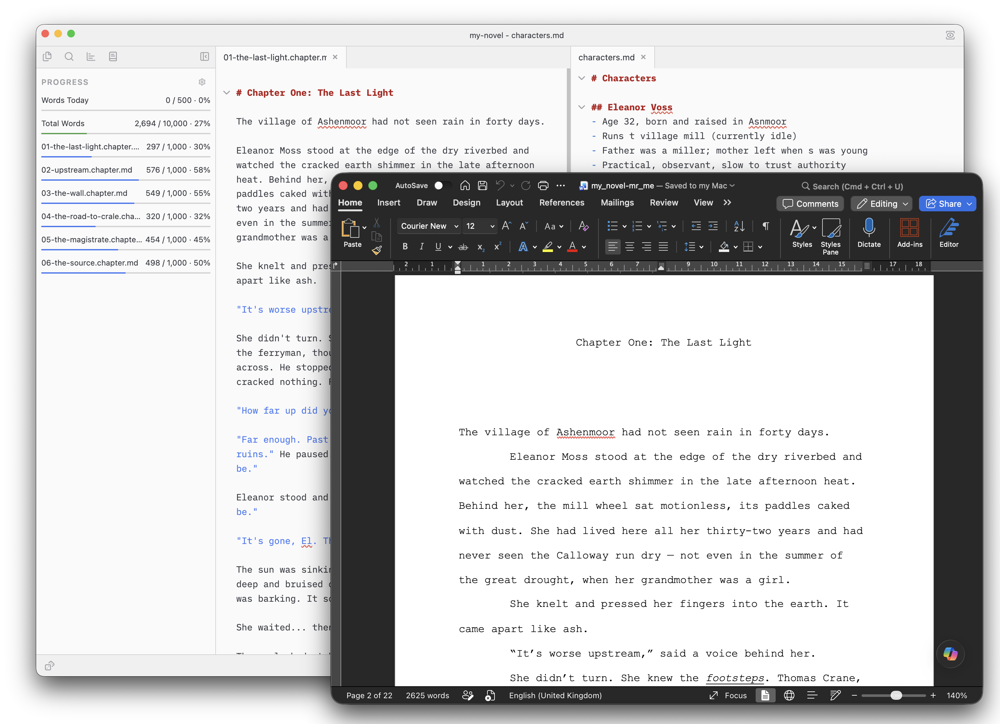

I write software for money and fiction for fun. Tools for writing fiction are not as good as tools for writing software.

When I began writing fiction I started with Google Docs, but this became unwieldy as my book grew beyond a few thousand words. Scrivener, a popular choice, was a big step up in chapter management, but I found it clunky and cumbersome.

Eventually, I switched to using software development tools.

Large software projects and fiction projects have a lot in common. Both involve months (or years) of reading, writing, and organising many files. Good tools should make that complexity easier to manage.

When I switched to VS Code, writing felt far more reliable and intuitive. I write in Markdown, plain text with simple formatting, which helps me stay focused on words instead of styling. For example:

```markdown
# Chapter 1

This is a paragraph of text, with _italics_ and **bold**.

> This is a quote

"Dialogue goes in quotes", said Sam.
```

VS Code also gave me things I cared about: configurable layouts, themes, focus mode, and powerful find and replace. I wrote about that [here](https://craig-russell.co.uk/blog/2024-11-28-vscode-for-writers/vscode-for-writers/).

But it didn't do everything I needed.

Markdown is great while drafting but I need to export my manuscript to share and publish. I began with [Pandoc](https://pandoc.org/), but never got exactly the output I wanted. 

I wrote my own scripts to compile Markdown to DOCX and to track word count and progress ([You can find those here](https://github.com/craig552uk/vscode-novel/tree/main)). These worked, but stitching my workflow together with scripts was never ideal. I needed something better.

I wanted the best parts of software-writing tools plus the essential functionality of fiction-writing tools, all in one app. I wanted to keep my files in folders, not inside a proprietary document format. I wanted flexible tab layouts, focus mode, light and dark themes, progress tracking, keyboard shortcuts, English spellcheck, and built-in DOCX export for manuscript submission.

I wanted a writer-first experience with the workflow quality of software development.

This didn't exist. So I built it.

I called it Mała (after my dog). It’s pronounced _MAH-wah_, not _MAH-la_. The name means "small" in Polish, because this is intentionally a small tool focused on getting from idea to manuscript.



Mała is for writers who write in Markdown. It includes flexible tab layouts (drag tabs where you want them), focus mode to limit distractions, light and dark themes for day/night time writing, progress tracking across daily/chapter/manuscript goals, and Word DOCX export in standard manuscript format.



By design, Mała does not include backup or publishing functionality. It works well with cloud backup tools like iCloud, Dropbox, and Google Drive, and exported DOCX files can be imported into publishing tools like Vellum or KDP.



Mała is currently free. If adoption grows, I may introduce a small one-time fee to support development, but I won’t charge a subscription - We all have enough subscriptions to pay...

I'd love you to try it and let me know what you think (social links below). How does Mała fit into your workflow? What works (or doesn't) for you? 

Mała is available for macOS and Windows.

Download at [malawriter.com](https://malawriter.com)
